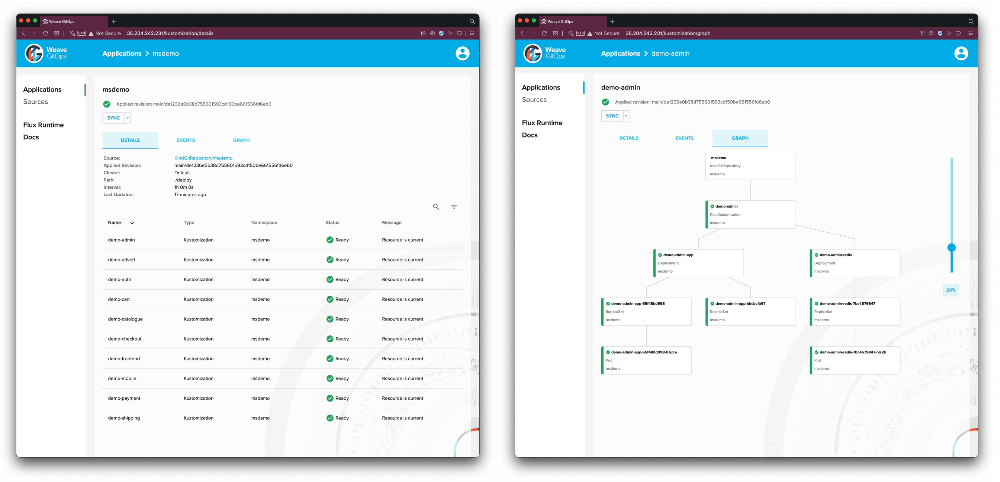

# podinfo-msdemo

Microservices demo made with podinfo



## Deploy

Add the following definitions to the bootstrap repo under a cluster e.g. `clusters/my-cluster/msdemo.yaml`:

```yaml
---
apiVersion: v1
kind: Namespace
metadata:
  name: msdemo
---
apiVersion: v1
kind: ServiceAccount
metadata:
  labels:
    toolkit.fluxcd.io/tenant: msdemo
  name: flux
  namespace: msdemo
---
apiVersion: rbac.authorization.k8s.io/v1
kind: RoleBinding
metadata:
  labels:
    toolkit.fluxcd.io/tenant: msdemo
  name: flux
  namespace: msdemo
roleRef:
  apiGroup: rbac.authorization.k8s.io
  kind: ClusterRole
  name: cluster-admin
subjects:
  - kind: ServiceAccount
    name: flux
    namespace: msdemo
---
apiVersion: source.toolkit.fluxcd.io/v1beta2
kind: GitRepository
metadata:
  name: msdemo
  namespace: msdemo
spec:
  interval: 1m0s
  ref:
    branch: main
  url: https://github.com/fluxcd-testing/podinfo-msdemo
---
apiVersion: kustomize.toolkit.fluxcd.io/v1beta2
kind: Kustomization
metadata:
  name: msdemo
  namespace: msdemo
spec:
  targetNamespace: msdemo
  interval: 60m0s
  retryInterval: 1m30s
  path: ./deploy
  prune: true
  wait: true
  timeout: 2m
  serviceAccountName: flux
  sourceRef:
    kind: GitRepository
    name: msdemo
  postBuild:
    substitute:
      app_namespace: msdemo
  patches:
    - target:
        kind: Kustomization
      patch: |
        - op: add
          path: /spec/serviceAccountName
          value: flux
        - op: add
          path: /spec/postBuild/substitute/app_version
          value: 6.1.4
```

To trigger a rolling deployment for all microservices, change the
[podinfo](https://github.com/stefanprodan/podinfo/releases) version in:

```yaml
  patches:
    - target:
        kind: Kustomization
      patch: |
        - op: add
          path: /spec/serviceAccountName
          value: flux
        - op: add
          path: /spec/postBuild/substitute/app_version
          value: 6.1.4 # <-- change it to 6.1.5
```

The above configuration will deploy the following workloads:

```console
$ flux -n msdemo tree kustomization msdemo
Kustomization/msdemo/msdemo
├── Kustomization/msdemo/demo-admin
│   ├── ConfigMap/msdemo/demo-admin-redis
│   ├── Service/msdemo/demo-admin-app
│   ├── Service/msdemo/demo-admin-redis
│   ├── Deployment/msdemo/demo-admin-app
│   ├── Deployment/msdemo/demo-admin-redis
│   └── HorizontalPodAutoscaler/msdemo/demo-admin-app
├── Kustomization/msdemo/demo-advert
│   ├── ConfigMap/msdemo/demo-advert-redis
│   ├── Service/msdemo/demo-advert-app
│   ├── Service/msdemo/demo-advert-redis
│   ├── Deployment/msdemo/demo-advert-app
│   ├── Deployment/msdemo/demo-advert-redis
│   └── HorizontalPodAutoscaler/msdemo/demo-advert-app
├── Kustomization/msdemo/demo-auth
│   ├── ConfigMap/msdemo/demo-auth-redis
│   ├── Service/msdemo/demo-auth-app
│   ├── Service/msdemo/demo-auth-redis
│   ├── Deployment/msdemo/demo-auth-app
│   ├── Deployment/msdemo/demo-auth-redis
│   └── HorizontalPodAutoscaler/msdemo/demo-auth-app
├── Kustomization/msdemo/demo-cart
│   ├── ConfigMap/msdemo/demo-cart-redis
│   ├── Service/msdemo/demo-cart-app
│   ├── Service/msdemo/demo-cart-redis
│   ├── Deployment/msdemo/demo-cart-app
│   ├── Deployment/msdemo/demo-cart-redis
│   └── HorizontalPodAutoscaler/msdemo/demo-cart-app
├── Kustomization/msdemo/demo-catalogue
│   ├── ConfigMap/msdemo/demo-catalogue-redis
│   ├── Service/msdemo/demo-catalogue-app
│   ├── Service/msdemo/demo-catalogue-redis
│   ├── Deployment/msdemo/demo-catalogue-app
│   ├── Deployment/msdemo/demo-catalogue-redis
│   └── HorizontalPodAutoscaler/msdemo/demo-catalogue-app
├── Kustomization/msdemo/demo-checkout
│   ├── ConfigMap/msdemo/demo-checkout-redis
│   ├── Service/msdemo/demo-checkout-app
│   ├── Service/msdemo/demo-checkout-redis
│   ├── Deployment/msdemo/demo-checkout-app
│   ├── Deployment/msdemo/demo-checkout-redis
│   └── HorizontalPodAutoscaler/msdemo/demo-checkout-app
├── Kustomization/msdemo/demo-frontend
│   ├── ConfigMap/msdemo/demo-frontend-redis
│   ├── Service/msdemo/demo-frontend-app
│   ├── Service/msdemo/demo-frontend-redis
│   ├── Deployment/msdemo/demo-frontend-app
│   ├── Deployment/msdemo/demo-frontend-redis
│   └── HorizontalPodAutoscaler/msdemo/demo-frontend-app
├── Kustomization/msdemo/demo-mobile
│   ├── ConfigMap/msdemo/demo-mobile-redis
│   ├── Service/msdemo/demo-mobile-app
│   ├── Service/msdemo/demo-mobile-redis
│   ├── Deployment/msdemo/demo-mobile-app
│   ├── Deployment/msdemo/demo-mobile-redis
│   └── HorizontalPodAutoscaler/msdemo/demo-mobile-app
├── Kustomization/msdemo/demo-payment
│   ├── ConfigMap/msdemo/demo-payment-redis
│   ├── Service/msdemo/demo-payment-app
│   ├── Service/msdemo/demo-payment-redis
│   ├── Deployment/msdemo/demo-payment-app
│   ├── Deployment/msdemo/demo-payment-redis
│   └── HorizontalPodAutoscaler/msdemo/demo-payment-app
└── Kustomization/msdemo/demo-shipping
    ├── ConfigMap/msdemo/demo-shipping-redis
    ├── Service/msdemo/demo-shipping-app
    ├── Service/msdemo/demo-shipping-redis
    ├── Deployment/msdemo/demo-shipping-app
    ├── Deployment/msdemo/demo-shipping-redis
    └── HorizontalPodAutoscaler/msdemo/demo-shipping-app
```
